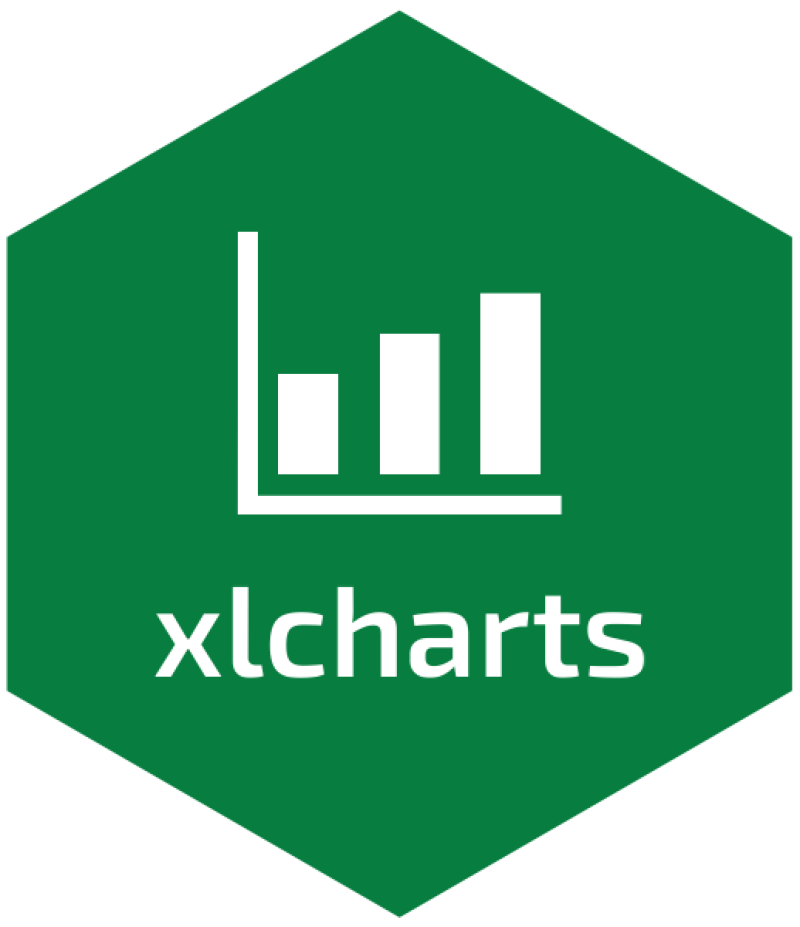
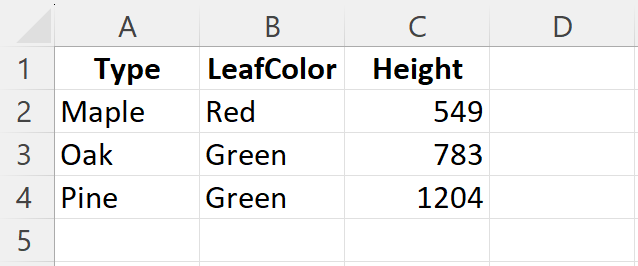
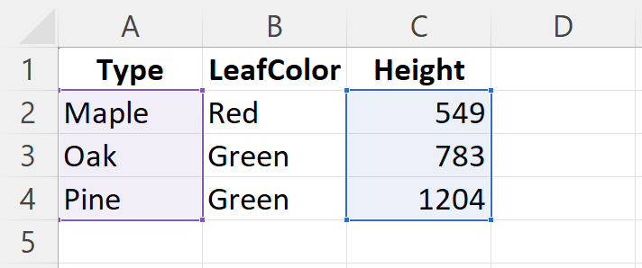
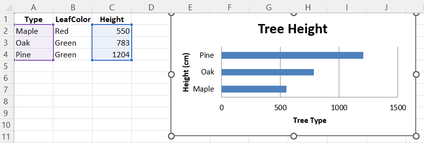

# xlcharts 

**xlcharts, an R interface to OpenPyXL to create native Excel charts and work with Microsoft Excel files.**

<!-- badges: start -->
[](https://CRAN.R-project.org/package=xlcharts)
[](https://cran.r-project.org/package=xlcharts)
[](https://github.com/lgnbhl/xlcharts/actions/workflows/R-CMD-check.yaml)
<!-- badges: end -->

- **Author**: Félix Luginbühl (<https://felixluginbuhl.com>)
- **Source code**: <https://github.com/lgnbhl/xlcharts>
- **Issues**: <https://github.com/lgnbhl/xlcharts/issues>

## Introduction

**xlcharts** was born from the lack of existing R packages to create native Excel
charts and make advanced customization on Microsoft Excel files.

It is an R wrapper for the
<a href="https://openpyxl.readthedocs.io" target="_blank">OpenPyXL</a> Python library using the
<a href="https://rstudio.github.io/reticulate/" target="_blank">reticulate</a>
R package under the hood. The [xlcharts documentation](https://felixluginbuhl.com/xlcharts/) is a
partial replica of the
<a href="https://openpyxl.readthedocs.io" target="_blank">OpenPyXL documentation</a>, where Python code is replaced by R code (when
possible).

All kudos goes to Eric Gazoni, Charlie Clark and other authors for developing the OpenPyXL Python library.

**FULL DOCUMENTATION AT [www.felixluginbuhl.com/xlcharts](https://felixluginbuhl.com/xlcharts/)**

## Installation

#### Install xlcharts 

``` r
install.packages("xlcharts")

# development version from GitHub:
#devtools::install_github("lgnbhl/xlcharts")
```

#### Install Miniconda

If Miniconda is not install on your machine, an R prompt should ask you
if you want to install it after loading the **xlcharts** R package. Type
“Y” for “yes”.

``` r
library(xlcharts)
```

    Would you like to install Miniconda? [Y/n]:

You can also install Miniconda using the **reticulate** R package.

``` r
reticulate::install_miniconda()
```

#### Install OpenPyXL Python library

Then you have to install the [OpenPyXL](https://openpyxl.readthedocs.io)
Python library.

``` r
xlcharts::install_openpyxl()
```

You can also specify a desired location for Python before interacting
with the functions of the R package.

``` r
#reticulate::use_virtualenv("~/pythonenvs/userenv")
```


## Create a workbook

To prevent potential formatting issue, we will always load data from an existing Excel file.

If you have a dataframe in R, you can simply write it as an Excel file
using the `write_xlsx()` function imported from the
[writexl](https://docs.ropensci.org/writexl/) R package.

``` r
library(xlcharts)

treeData <- data.frame(
  "Type" = c("Maple", "Oak", "Pine"), 
  "LeafColor" = c("Red", "Green", "Green"), 
  "Height" = c(549, 783, 1204)
  )

write_xlsx(x = treeData, path = "treeData.xlsx")
```



Then you can load the Excel workbook in R using `load_workbook()`.

``` r
wb <- load_workbook(filename = "treeData.xlsx")
```

Let’s get the active worksheet of our workbook.

``` r
ws <- wb |> active()
```

## Access cells

You can access and modify cells using double brackets or `cell()`:

``` r
ws[["C2"]]$value <- 550
#ws$cell(row = 2, column = 3, value = 550) # also works

ws[["C2"]]$value
```

    [1] 550

Ranges of cells can be accessed using slicing:

``` r
colC <- ws[["C"]]
col_range = ws[["C:D"]]
row10 <- ws[[10]]
```

Get the dimensions:

``` r
ws$dimensions
```

    [1] "A1:C4"

## Make a bar chart

We need to add references to where the data and categories are in the
worksheet.

``` r
data <- Reference(ws, min_col = 3, min_row = 2, max_row = 4, max_col = 3)
categories <- Reference(ws, min_col = 1, min_row = 2, max_row = 4, max_col = 1)
```



Now we can construct the skeleton of what will be our bar chart.

``` r
chart <- BarChart(
  type = "bar",
  title = "Tree Height",
  legend = NULL
) |>
  x_axis(title = "Height (cm)") |>
  y_axis(title = "Tree Type")
```

And pass the data and categories to the chart object.

``` r
chart |>
  add_data(data = data) |>
  set_categories(labels = categories)
```

We can add the chart to the worksheet.

``` r
ws |> add_chart(chart, anchor =  "E1")
```

And finally save the workbook as an Excel file.

``` r
wb |> save_workbook("TreeData.xlsx")
```



## For advanced users

The **xlcharts** R functions give access to [OpenPyXL Python
classes](https://openpyxl.readthedocs.io/en/stable/api/openpyxl.html).

Properties and methods can be accessed using the `$` sign on any object,
for example:

``` r
wb <- Workbook()
ws <- wb$active
wb$save(filename = "empty.xlsx")
```

The OpenPyXL Python related documentation URL is provided in every R
function documentation, where all arguments/parameters are described in
more details. Documentation can be accessed using the `?` sign, for
example:

``` r
?Workbook()
```

The **xlcharts** R package also provides additional R functions (not calling an OpenPyXL Python class) as helpers, to make the R code easier to read and write:

- `active()`
- `x_axis()`
- `y_axis()`
- `set_catagories()`
- `add_data()`
- `add_table()`
- `add_chart()` 

It also provides functions imported from other Python modules:

- `iadd()` from the operator Python module.
- `deepcopy()` from the copy Python module.

Important differences between Python and R:

- lists start at 0 with Python, but at 1 with R.
- instead of single brackets (`[]`) in Python, use double brackets
  (`[[]]`) with R.

Always keep in mind that **Python array indices are zero-based, while R
indices are 1-based**.

Numbers used in arguments/parameters should be integers (use `L` after
the number in R), for example `1L`, to be correctly evaluated by the
OpenPyXL Python library.

Unfortunately some OpenPyXL Python classes from different module have similar names. An arbitrary choice has been made to import some from a 
specific module instead of another. Maybe a condition will be added in 
a future version of the package (any contribution is very welcomed!). In 
the meantime, you can access any class as such:

``` r
openpyxl <- reticulate::import("openpyxl")
openpyxl$[OpenPyXL Python class]
```

## Contribute

Any contribution is very welcomed!

If you find this R package helpful, feel free to mention it on social
media. You can follow me on LinkedIn for R package updates:
[Felix Luginbuhl](https://www.linkedin.com/in/FelixLuginbuhl).
