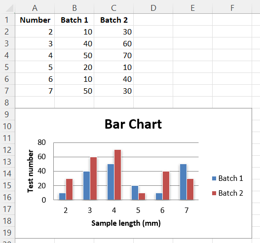

# Positioning Charts with Anchors

You can position charts using one of three different kinds of anchor:

- OneCell – where the top-left of a chart is anchored to a single cell. This is the default for openpyxl and corresponds to the layout option “Move but don’t size with cells”.
- TwoCell – where the top-left of a chart is anchored to one cell, and the bottom-right to another cell. This corresponds to the layout option “Move and size with cells”.
- Absolute – where the chart is placed relative to the worksheet’s top-left corner and not any particular cell.

You can change anchors quite easily on a chart like this. Let’s assume we have created a bar chart using the sample code:

```r
library(xlcharts)

bar <- data.frame(
  "Number" = c(2,3,4,5,6,7),
  "Batch 1" = c(10,40,50,20,10,50),
  "Batch 2" = c(30,60,70,10,40,30), 
  check.names = FALSE
)

write_xlsx(bar, path = "bar.xlsx")

wb <- load_workbook(filename = "bar.xlsx")
ws <- active(wb)

chart1 <- BarChart(
  type = "col",
  style = 10,
  title = "Bar Chart",
  shape = 4
) |>
  y_axis(title = "Test number") |>
  x_axis(title = "Sample length (mm)")

data <- Reference(ws, min_col=2, min_row=1, max_row=7, max_col=3)
cats <- Reference(ws, min_col=1, min_row=2, max_row=7)

chart1 |>
  add_data(data = data, titles_from_data = TRUE) |>
  set_categories(cats)

```

Let’s take the first chart. Instead of anchoring it to A10, we want it to keep it with our table of data, say A9 to C20. We can do this by creating a TwoCellAnchor for those two cells.:

```r
anchor <- TwoCellAnchor(
  from = AnchorMarker(col = 0, row = 8),
  to = AnchorMarker(col = 6, row = 19)
)

ws |> add_chart(chart1, anchor = anchor)

save_workbook(wb, "bar.xlsx")
```



You can also use this to change the anchors of existing charts.

<small>This page is an R replica of the related [OpenPyXL documentation page](https://openpyxl.readthedocs.io/en/stable/charts/anchors.html).</small>
