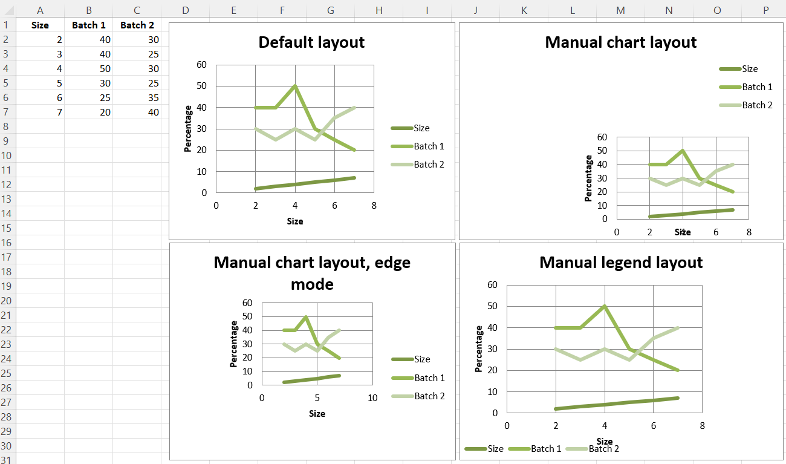

# Changing the layout of plot area and legend

The layout of the chart within the canvas can be set by using the layout property of an instance of a layout class.

## Chart layout

### Size and position

The chart can be positioned within its container. 'x' and 'y' adjust position, w and h adjust the size . The units are proportions of the container. A chart cannot be positioned outside of its container and the width and height are the dominant constraints: if x + w > 1, then x = 1 - w.

x is the horizontal position from the left
y is the vertical position from the top
h is the height of the chart relative to its container
w is the width of the box
Mode

In addition to the size and position, the mode for the relevant attribute can also be set to either factor or edge. Factor is the default.


### Target

The layoutTarget can be set to outer or inner. The default is outer.


## Legend layout

The position of the legend can be controlled either by setting its position: r, l, t, b, and tr, for right, left, top, bottom and top right respectively. The default is r.

```r
library(xlcharts)

chart_layout <- data.frame(
  "Size" = c(2, 3, 4, 5, 6, 7),
  "Batch 1" = c(40, 40, 50, 30, 25, 20),
  "Batch 2" = c(30, 25, 30, 25, 35, 40), 
  check.names = FALSE
)

write_xlsx(chart_layout, "chart_layout.xlsx")

wb <- load_workbook(filename = "chart_layout.xlsx") 
ws <- wb |> active()

ch1 <- ScatterChart(
  title = "Default layout",
  style = 13,
  legend = Legend(position = "r") # right position
) |>
  x_axis(title = "Size") |> 
  y_axis(title = 'Percentage')

xvalues = Reference(ws, min_col=1, min_row=2, max_row=7)
for (i in c(1:3)) {
    values <- Reference(ws, min_col=i, min_row=1, max_row=7)
    series <- Series(values, xvalues, title_from_data = TRUE)
    ch1$append(series)
}

ws |> add_chart(ch1, "B10")

# Half-size chart, bottom right
ch2 <- ScatterChart(
  title = "Manual chart layout",
  style = 13,
  legend = Legend(position = "tr"), # top right position
  layout = Layout(
    manualLayout = ManualLayout(
        x=0.25, y=0.25,
        h=0.5, w=0.5,
    )
  )
) |>
  x_axis(title = "Size") |> 
  y_axis(title = 'Percentage')

for (i in c(1:3)) {
    values <- Reference(ws, min_col=i, min_row=1, max_row=7)
    series <- Series(values, xvalues, title_from_data = TRUE)
    ch2$append(series)
}

ws |> add_chart(ch2, "H10")

# Half-size chart, centred
ch3 <- ScatterChart(
  title = "Manual chart layout, edge mode",
  style = 13,
  legend = Legend(position = "r"),
  layout = Layout(
      ManualLayout(
        x=0.25, y=0.25,
        h=0.5, w=0.5,
        xMode="edge",
        yMode="edge"
      )
    )
) |>
  x_axis(title = "Size") |> 
  y_axis(title = 'Percentage')

xvalues = Reference(ws, min_col=1, min_row=2, max_row=7)
for (i in c(1:3)) {
    values <- Reference(ws, min_col=i, min_row=1, max_row=7)
    series <- Series(values, xvalues, title_from_data = TRUE)
    ch3$append(series)
}

ws |> add_chart(ch3, "B27")

# Manually position the legend bottom left
ch4 <- ScatterChart(
  title = "Manual legend layout",
  style = 13,
  legend = Legend(
    layout = Layout(
      manualLayout = ManualLayout(
          yMode='edge',
          xMode='edge',
          x=0, y=0.9,
          h=0.1, w=0.5
      ))
    )
) |>
  x_axis(title = "Size") |> 
  y_axis(title = 'Percentage')

xvalues = Reference(ws, min_col=1, min_row=2, max_row=7)
for (i in c(1:3)) {
    values <- Reference(ws, min_col=i, min_row=1, max_row=7)
    series <- Series(values, xvalues, title_from_data = TRUE)
    ch4$append(series)
}

ws |> add_chart(ch4, "H27")

save_workbook(wb, "chart_layout.xlsx")
```

This produces four charts illustrating various possibilities:



<small>This page is an R replica of the related [OpenPyXL documentation page](https://openpyxl.readthedocs.io/en/stable/charts/chart_layout.html).</small>
