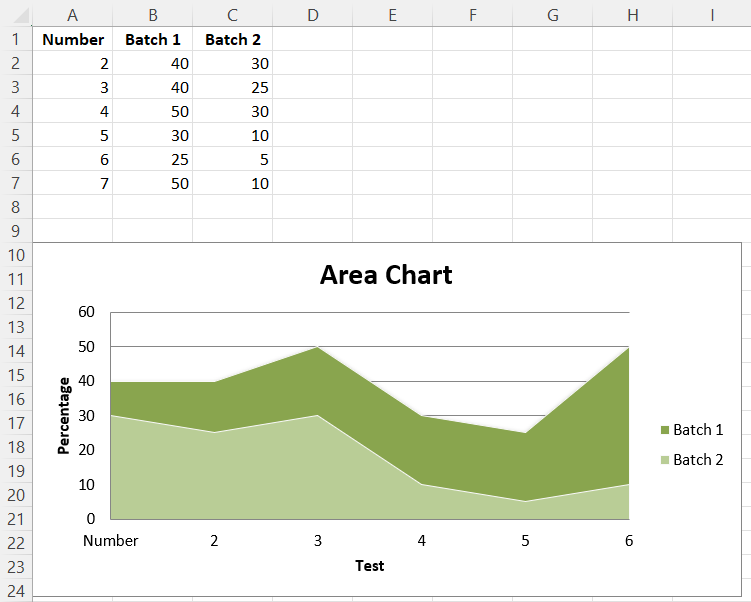
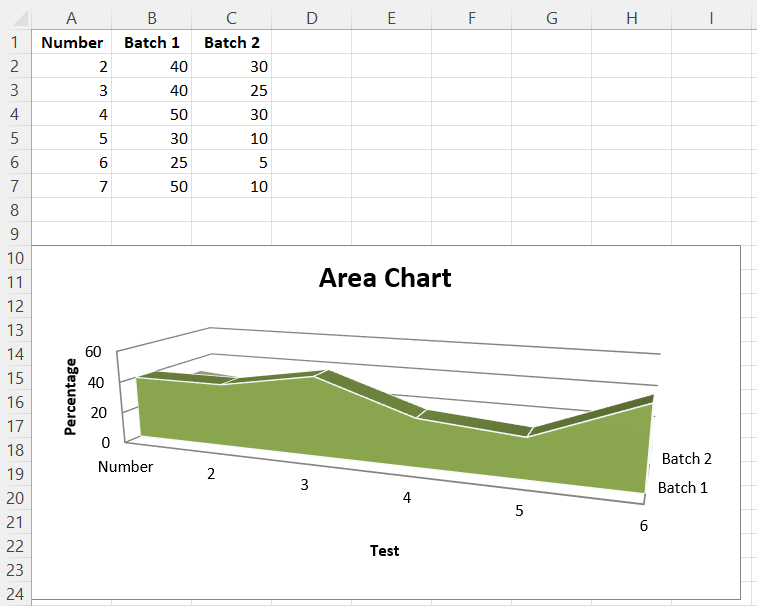

# Area Charts

## 2D Area Charts

Area charts are similar to line charts with the addition that the area underneath the plotted line is filled. Different variants are available by setting the grouping to “standard”, “stacked” or “percentStacked”; “standard” is the default.

```r
library(xlcharts)

area <- data.frame(
  "Number" = c(2,3,4,5,6,7),
  "Batch 1" = c(40,40,50,30,25,50),
  "Batch 2" = c(30,25,30,10,5,10),
  check.names = FALSE
)

write_xlsx(area, path = "area.xlsx")

wb <- load_workbook(filename = "area.xlsx")
ws <- wb |> active()

chart <- AreaChart(
  title = "Area Chart",
  style = 13
) |>
  x_axis(title = "Test") |>
  y_axis(title = "Percentage")

cats <- Reference(ws, min_col=1, min_row=1, max_row=7)
data <- Reference(ws, min_col=2, min_row=1, max_col=3, max_row=7)

chart |> 
  add_data(data, titles_from_data = TRUE) |> 
  set_categories(cats)

ws |> add_chart(chart, "A10")

save_workbook(wb, "area.xlsx")
```



## 3D Area Charts

You can also create 3D area charts.

<div class="admonition warning">
<p class="admonition-title">Warning</p>
<p>3D charts are almost always inappropriately used, as interpretation is improved by turning them into regular 2D figures. Please avoid making 3D charts.</p>
</div>

```r
chart <- AreaChart3D(
  title = "Area Chart",
  style = 13,
  legend = NULL
) |>
  x_axis(title = 'Test') |>
  y_axis(title = 'Percentage')

cats <- Reference(ws, min_col=1, min_row=1, max_row=7)
data <- Reference(ws, min_col=2, min_row=1, max_col=3, max_row=7)

chart |>
  add_data(data, titles_from_data = TRUE) |>
  set_categories(cats)

ws |> add_chart(chart, "A10")

save_workbook(wb, "area3D.xlsx")
```

This produces a simple 3D area chart where the third axis can be used to replace the legend:



<small>This page is an R replica of the related [OpenPyXL documentation page](https://openpyxl.readthedocs.io/en/stable/charts/area.html).</small>
