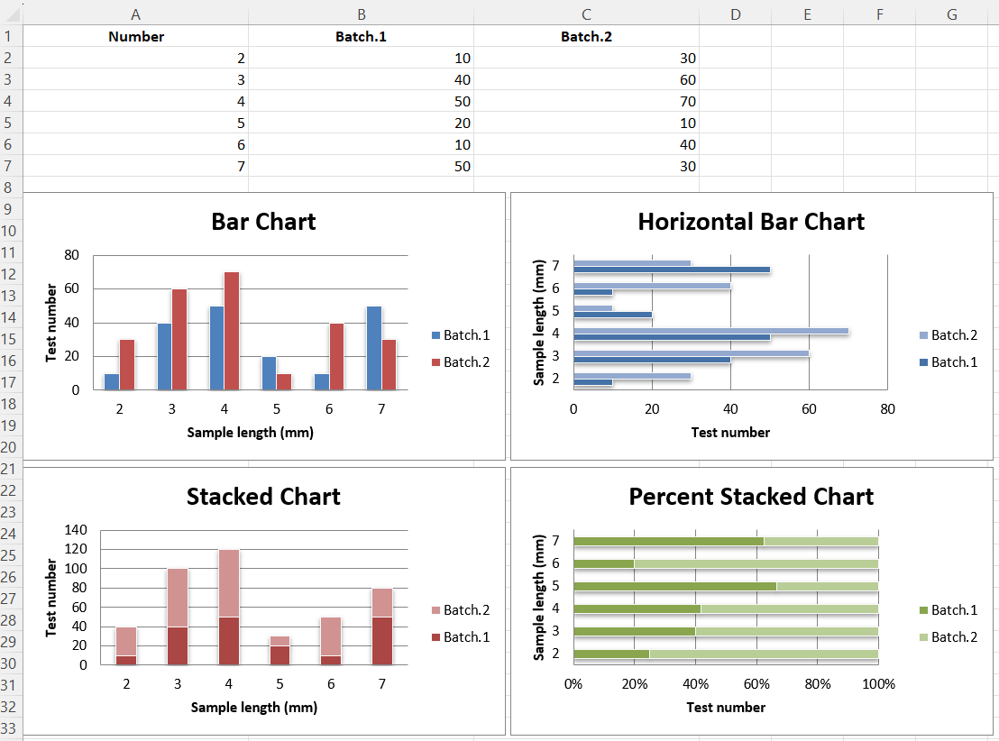
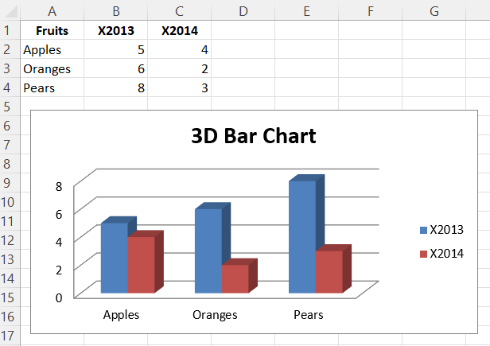

# Bar and Column Charts

In bar charts values are plotted as either horizontal bars or vertical columns.

### Vertical, Horizontal and Stacked Bar Charts.

<div class="admonition note">
<p class="admonition-title">Note</p>
<p>The following settings affect the different chart types. Switch between vertical and horizontal bar charts by setting type to "col"" or "bar" respectively. When using stacked charts the overlap needs to be set to `100`. If bars are horizontal, x and y axes are reversed.</p>
</div>

```r
library(xlcharts)

bar <- data.frame(
  "Number" = c(2,3,4,5,6,7),
  "Batch 1" = c(10,40,50,20,10,50),
  "Batch 2" = c(30,60,70,10,40,30)
)

write_xlsx(bar, path = "bar.xlsx")

wb <- load_workbook(filename = "bar.xlsx")
ws <- active(wb)

chart1 <- BarChart(
  type = "col",
  style = 10,
  title = "Bar Chart",
  shape = 4
) |>
  y_axis(title = "Test number") |>
  x_axis(title = "Sample length (mm)")

data <- Reference(ws, min_col=2, min_row=1, max_row=7, max_col=3)
cats <- Reference(ws, min_col=1, min_row=2, max_row=7)

chart1 |>
  add_data(data = data, titles_from_data = TRUE) |>
  set_categories(cats)

ws |> add_chart(chart1, "A10")
```

```r
chart2 <- BarChart(
  type = "bar",
  style = 11,
  title = "Horizontal Bar Chart",
  shape = 4
) |>
  y_axis(title = 'Test number') |>
  x_axis(title = 'Sample length (mm)')

chart2 |>
  add_data(data = data, titles_from_data = TRUE) |>
  set_categories(cats)

ws |> add_chart(chart2, "G10")
```

```r
chart3 <- BarChart(
  type = "col",
  style = 12,
  title = "Stacked Chart",
  shape = 4,
  grouping = "stacked",
  overlap = 100
) |>
  y_axis(title = 'Test number') |>
  x_axis(title = 'Sample length (mm)')

chart3 |>
  add_data(data = data, titles_from_data = TRUE) |>
  set_categories(cats)

ws |> add_chart(chart3, "A27")
```

```r
chart4 <- BarChart(
  type = "bar",
  style = 13,
  title = "Percent Stacked Chart",
  shape = 4,
  grouping = "percentStacked",
  overlap = 100
) |>
  y_axis(title = 'Test number') |>
  x_axis(title = 'Sample length (mm)')

chart4 |>
  add_data(data = data, titles_from_data = TRUE) |>
  set_categories(cats)

ws |> add_chart(chart4, "G27")
```

```r
save_workbook(wb, "bar.xlsx")
```

This will produce four charts illustrating the various possibilities.



### 3D Bar Charts

<div class="admonition warning">
<p class="admonition-title">Warning</p>
<p>3D charts are almost always inappropriately used, as interpretation is improved by turning them into regular 2D figures. Please avoid making 3D charts.</p>
</div>

This produces a simple 3D bar chart.

```r
library(xlcharts)

bar3d <- data.frame(
  "Fruits" = c("Apples", "Oranges", "Pears"),
  "2013" = c(5, 6, 8),
  "2014" = c(4, 2, 3)
)

write_xlsx(bar3d, path = "bar3d.xlsx")

wb <- load_workbook(filename = "bar3d.xlsx")
ws <- active(wb)

data <- Reference(ws, min_col=2, min_row=1, max_col=3, max_row=4)
titles <- Reference(ws, min_col=1, min_row=2, max_row=4)

chart <- BarChart3D(
  title = "3D Bar Chart"
) |>
  add_data(data = data, titles_from_data = TRUE) |>
  set_categories(labels = titles)

ws |> add_chart(chart, "E5")

save_workbook(wb, "bar3d.xlsx")
```



<small>This page is an R replica of the related [OpenPyXL documentation page](https://openpyxl.readthedocs.io/en/stable/charts/bar.html).</small>
