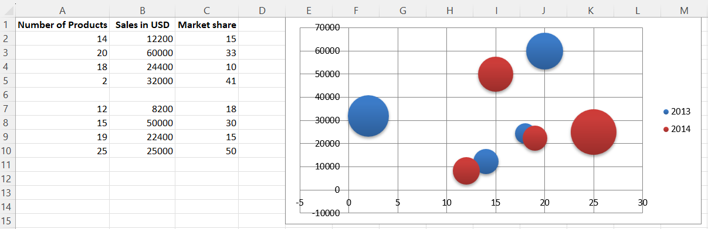

# Bubble Charts

Bubble charts are similar to scatter charts but use a third dimension to determine the size of the bubbles.
Charts can include multiple series.

```r
library(xlcharts)

bubble <- data.frame(
  "Number of Products" = c(14, 20, 18, 2, NA, 12, 15, 19, 25),
  "Sales in USD" = c(12200, 60000, 24400, 32000, NA, 8200, 50000, 22400, 25000),
  "Market share" = c(15, 33, 10, 41, NA, 18, 30, 15, 50),
  check.names = FALSE
)

write_xlsx(bubble, "bubble.xlsx")

wb <- load_workbook(filename = "bubble.xlsx")
ws <- wb |> active()

chart <- BubbleChart(
  style = 18 # use a preset style
)

# add the first series of data
xvalues <- Reference(ws, min_col=1, min_row=2, max_row=5)
yvalues <- Reference(ws, min_col=2, min_row=2, max_row=5)
size <- Reference(ws, min_col=3, min_row=2, max_row=5)
series1 <- Series(values=yvalues, xvalues=xvalues, zvalues=size, title="2013")

chart$append(series1)

# add the second
xvalues <- Reference(ws, min_col=1, min_row=7, max_row=10)
yvalues <- Reference(ws, min_col=2, min_row=7, max_row=10)
size <- Reference(ws, min_col=3, min_row=7, max_row=10)
series2 <- Series(values=yvalues, xvalues=xvalues, zvalues=size, title="2014")

chart$append(series2)

# place the chart starting in cell E1
ws |> add_chart(chart, "E1")

wb |> save_workbook("bubble.xlsx")
```

This will produce a bubble chart with two series and should look something like this:



<small>This page is an R replica of the related [OpenPyXL documentation page](https://openpyxl.readthedocs.io/en/stable/charts/bubble.html).</small>
