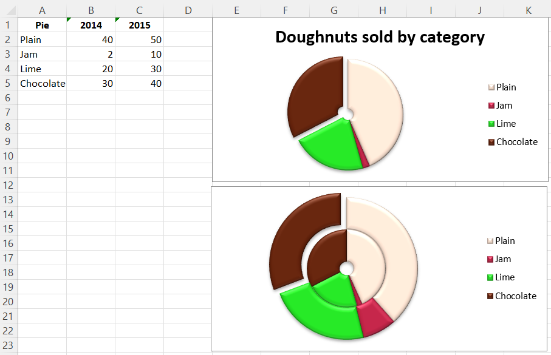

# Doughnut Charts

Doughnut charts are similar to pie charts except that they use a ring instead of a circle. They can also plot several series of data as concentric rings.

```r
library(xlcharts)

doughnut <- data.frame(
  "Pie" = c("Plain", "Jam", "Lime", "Chocolate"),
  "2014" = c(40, 2, 20, 30),
  "2015" = c(50, 10, 30, 40),
  check.names = FALSE
)

write_xlsx(doughnut, "doughnut.xlsx")

wb <- load_workbook(filename = "doughnut.xlsx")
ws <- wb |> active()

chart <- DoughnutChart(
  title = "Doughnuts sold by category",
  style = 26
)

labels <- Reference(ws, min_col=1, min_row=2, max_row=5)
data <- Reference(ws, min_col=2, min_row=1, max_row=5)

chart |> add_data(data, titles_from_data = TRUE)
chart |> set_categories(labels)

# Cut the first slice out of the doughnut
plain <- DataPoint(idx = 0)
jam <- DataPoint(idx = 1)
lime <- DataPoint(idx = 2)
chocolate <- DataPoint(idx = 3)

slices <- list(plain, jam, lime, chocolate)

chart$series[[1]]$data_points <- slices

plain$graphicalProperties <- GraphicalProperties(
  solidFill = "FAE1D0"
)
jam$graphicalProperties <- GraphicalProperties(
    solidFill = "BB2244"
  )
lime$graphicalProperties <- GraphicalProperties(
    solidFill = "22DD22"
  )
chocolate$graphicalProperties <- GraphicalProperties(
    solidFill = "61210B"
  )
chocolate[["explosion"]] <- 10L

ws |> add_chart(chart, "E1")

# Chart 2
chart2 <- DoughnutChart(
  title = NULL,
  style = 26
)

chart2 |> add_data(data, titles_from_data = TRUE)
chart2 |> set_categories(labels)

# Cut the first slice out of the doughnut
plain <- DataPoint(idx = 0)
jam <- DataPoint(idx = 1)
lime <- DataPoint(idx = 2)
chocolate <- DataPoint(idx = 3)

slices <- list(plain, jam, lime, chocolate)

chart2$series[[1]]$data_points <- slices

plain$graphicalProperties <- GraphicalProperties(
    solidFill = "FAE1D0"
  )
jam$graphicalProperties <- GraphicalProperties(
    solidFill = "BB2244"
  )
lime$graphicalProperties <- GraphicalProperties(
    solidFill = "22DD22"
  )
chocolate$graphicalProperties <- GraphicalProperties(
    solidFill = "61210B"
  )
chocolate[["explosion"]] <- 10L

data2 <- Reference(ws, min_col=3, min_row=1, max_row=5)
series2 <- Series(data2, title_from_data = TRUE)
series2$data_points <- slices

chart2$append(series2)

ws |> add_chart(chart2, "E17")

wb |> save_workbook("doughnut.xlsx")
```



<small>This page is an R replica of the related [OpenPyXL documentation page](https://openpyxl.readthedocs.io/en/stable/charts/doughnut.html).</small>
