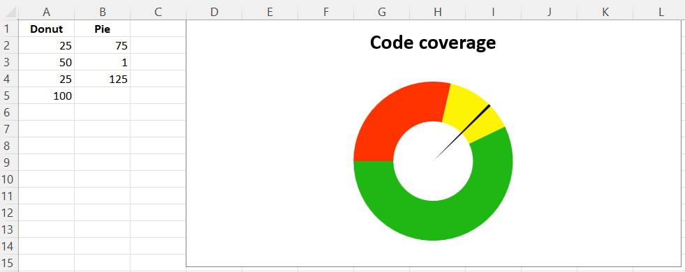

# Gauge Charts

Gauge charts combine a pie chart and a doughnut chart to create a “gauge”. The first chart is a doughnut chart with four slices. The first three slices correspond to the colours of the gauge; the fourth slice, which is half of the doughnut, is made invisible.

A pie chart containing three slices is added. The first and third slice are invisible so that the second slice can act as the needle on the gauge.

The effects are done using the graphical properties of individual data points in a data series.

```r
library(xlcharts)

gauge <- data.frame(
  "Donut" = c(25, 50, 25, 100),
  "Pie" = c(75, 1, 125, NA)
)

write_xlsx(gauge, "gauge.xlsx")

# based on http://www.excel-easy.com/examples/gauge-chart.html

wb <- load_workbook(filename = "gauge.xlsx") 
ws <- wb |> active()

# First chart is a doughnut chart
c1 <- DoughnutChart(
  firstSliceAng = 270, 
  holeSize = 50,
  title = "Code coverage",
  legend = NULL
)

ref <- Reference(ws, min_col=1, min_row=2, max_row=5)
s1 <- Series(ref, title_from_data=TRUE)

slice_1 <- DataPoint(idx = 0)
slice_2 <- DataPoint(idx = 1)
slice_3 <- DataPoint(idx = 2)
slice_4 <- DataPoint(idx = 3)


slice_1$graphicalProperties <- GraphicalProperties(solidFill = "FF3300") # red
slice_2$graphicalProperties <- GraphicalProperties(solidFill = "FCF305") # yellow
slice_3$graphicalProperties <- GraphicalProperties(solidFill = "1FB714") # green
slice_4$graphicalProperties <- GraphicalProperties(noFill = TRUE) # invisible

s1$data_points <- list(slice_1, slice_2, slice_3, slice_4)
c1$series <- list(s1)

# Second chart is a pie chart
c2 <- PieChart(
  firstSliceAng = 270,
  legend = NULL
)

ref <- Reference(ws, min_col=2, min_row=2, max_col=2, max_row=4)
s2 <- Series(ref, title_from_data = FALSE)

slice_1 <- DataPoint(idx = 0)
slice_2 <- DataPoint(idx = 1)
slice_3 <- DataPoint(idx = 2)

slice_1$graphicalProperties <- GraphicalProperties(noFill = TRUE) # invisible
slice_2$graphicalProperties <- GraphicalProperties(solidFill =  "000000") # black needle
slice_3$graphicalProperties <- GraphicalProperties(noFill = TRUE) # invisible

s2$data_points <- list(slice_1, slice_2, slice_3)
c2$series <- list(s2)

# combine using iadd from the operator Python module
iadd(c1, c2)

ws |> add_chart(c1, anchor = "D1")

wb |> save_workbook("gauge.xlsx")
```



<small>This page is an R replica of the related [OpenPyXL documentation page](https://openpyxl.readthedocs.io/en/stable/charts/gauge.html).</small>
