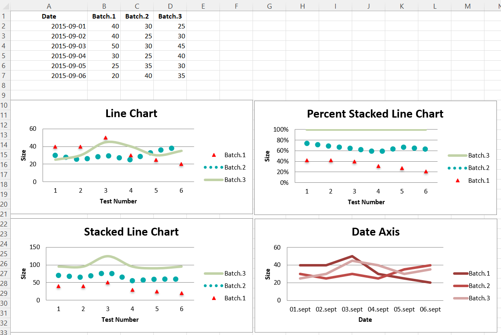
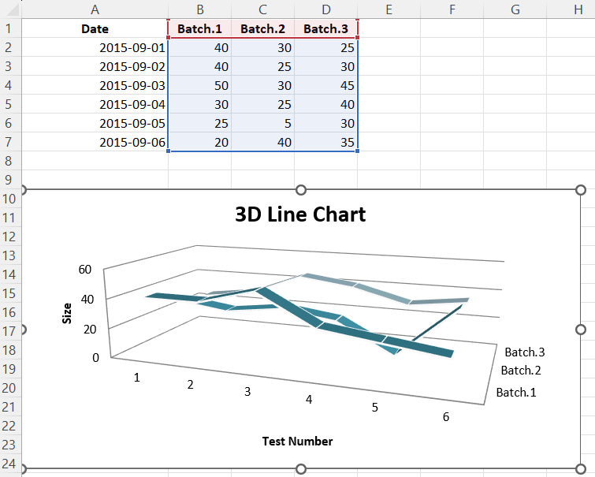

# Line Charts

## Three kinds of line charts

Line charts allow data to be plotted against a fixed axis. They are similar
to scatter charts, the main difference is that with line charts each data
series is plotted against the same values. Different kinds of axes can be
used for the secondary axes.

Similar to bar charts there are three kinds of line charts: standard, stacked
and percentStacked.

```r
library(xlcharts)

line <- data.frame(
  "Date" = as.Date(c("2015-09-01", "2015-09-02", "2015-09-03", 
                     "2015-09-04", "2015-09-05", "2015-09-06")),
  "Batch 1" = c(40, 40, 50, 30, 25, 20),
  "Batch 2" = c(30, 25, 30, 25, 35, 40),
  "Batch 3" = c(25, 30, 45, 40, 30, 35)
)

write_xlsx(line, "line.xlsx")

wb <- load_workbook(filename = "line.xlsx")

ws <- wb |> active()

c1 <- LineChart(
  title = "Line Chart",
  style = 13
) |>
  y_axis(title = 'Size') |>
  x_axis(title = 'Test Number')

data <- Reference(ws, min_col=2, min_row=1, max_col=4, max_row=7)

c1 |> add_data(data, titles_from_data = TRUE)

# Serie 1
s1 <- c1$series[[1]]

# marker
s1$marker <- Marker(symbol = "triangle")

# marker.graphicalProprieties
s1$marker$graphicalProperties <- GraphicalProperties(
  solidFill = "FF0000",
  line = LineProperties(solidFill = "FF0000")
  )

# graphicalProprieties.line
s1$graphicalProperties <- GraphicalProperties(
  line = LineProperties(noFill = TRUE)
)

# Serie 2
s2 <- c1$series[[2]]

# graphicalProprieties.line
s2$graphicalProperties <- GraphicalProperties(
  line = LineProperties(
    solidFill = "00AAAA",
    dashStyle = "sysDot",
    width = 100050
    )
  )

s3 <- c1$series[[3]]
s3[["smooth"]] <- TRUE # Make the line smooth

ws |> add_chart(c1, anchor = "A10")

# Stacked Line Chart
stacked <- deepcopy(c1)
stacked$grouping <- "stacked"
stacked$title <- "Stacked Line Chart"

ws |> add_chart(stacked, anchor = "A27")

# Percent Stacked Line Chart
percent_stacked <- deepcopy(c1)
percent_stacked$grouping <- "percentStacked"
percent_stacked$title <- "Percent Stacked Line Chart"

ws |> add_chart(percent_stacked, anchor = "A44")

# Chart with date axis
c2 <- LineChart(
  title = "Date Axis",
  style = 12
) |>
  y_axis(
    title = "Size"#,
    #crossAx = 500
  ) |>
  x_axis(
    number_format = 'd-mmm',
    majorTimeUnit = "days",
    title = "Date"
  )

dates <- Reference(ws, min_col=1, min_row=2, max_row=7)

c2 |> 
  add_data(data, titles_from_data = TRUE) |> 
  set_categories(dates)

ws |> add_chart(c2, "A61")

wb |> save_workbook("line.xlsx")
```



## 3D Line Charts

In 3D line charts the third axis is the same as the legend for the series.

<div class="admonition warning">
<p class="admonition-title">Warning</p>
<p>3D charts are almost always inappropriately used, as interpretation is improved by turning them into regular 2D figures. Please avoid making 3D charts.</p>
</div>

```r
wb <- load_workbook(filename = "line.xlsx")
ws <- wb |> active()

c1 <- LineChart3D(
  title = "3D Line Chart",
  legend = NULL,
  style = 15
) |>
  y_axis(title = 'Size') |>
  x_axis(title = 'Test Number')

data <- Reference(ws, min_col=2, min_row=1, max_col=4, max_row=7)

c1 |> add_data(data, titles_from_data = TRUE)

ws |> add_chart(c1, "A10")

wb |> save_workbook("line3D.xlsx")

```



<small>This page is an R replica of the related [OpenPyXL documentation page](https://openpyxl.readthedocs.io/en/stable/charts/line.html).</small>
