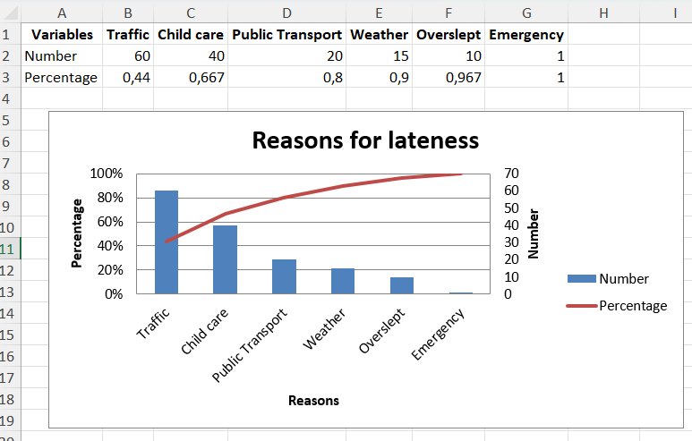

# Pareto Charts

A Pareto chart is a type of chart that contains both bars and a line graph, where individual values are represented in descending order by bars, and the cumulative total is represented by the line. The chart is named for the Pareto principle, which, in turn, derives its name from Vilfredo Pareto, an Italian economist. 

You can find another example of two charts combined together in the following page: [add a second axis](https://felixluginbuhl.com/xlcharts/articles/secondary/).

```r
library(xlcharts)

pareto <- data.frame(
  "Variables" = c("Number", "Percentage"),
  "Traffic" = c(60, 0.44),
  "Child care" = c(40, 0.667),
  "Public Transport" = c(20, 0.8),
  "Weather" = c(15, 0.9),
  "Overslept" = c(10, 0.967),
  "Emergency" = c(1, 1), 
  check.names = FALSE
)

write_xlsx(pareto, "pareto.xlsx")

wb <- load_workbook(filename = "pareto.xlsx") 
ws <- wb |> active()

c1 <- BarChart(
  title = 'Reasons for lateness'
) |>
  x_axis(title = "Reasons") |>
  y_axis(title = "Number",
         majorGridlines = NULL #,
         # scaling = Scaling(
         #     min = 0,
         #     max = 120
         #   )
         )

v1 <- Reference(ws, min_col = 1, min_row = 2, max_col = 7)
titles <- Reference(ws, min_col = 2, min_row = 1, max_col = 7)

c1 |> add_data(v1, titles_from_data=TRUE, from_rows=TRUE) |>
  set_categories(labels = titles)

# Create a second chart

c2 <- LineChart() |>
  y_axis(
    title = "Percentage", 
    axId = 200,
    number_format = '0%',
    scaling = Scaling(
      min = 0,
      max = 1
    )
  )

v2 <- Reference(ws, min_col=1, min_row=3, max_col=7)
c2 |> add_data(v2, titles_from_data=TRUE, from_rows=TRUE)

# Display y-axis of the second chart on the right by setting it to cross the x-axis at its maximum
c1 |> 
  y_axis(
    crosses = "max"
  )

# combine using iadd from the operator Python module
iadd(c1, c2)

ws |> add_chart(c1, "D5")

wb |> save_workbook("pareto.xlsx")
```



<small>This page is an adaptation of the [Adding a second axis](https://felixluginbuhl.com/xlcharts/articles/secondary/) page.</small>

