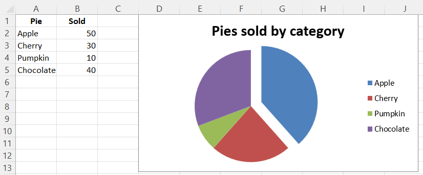
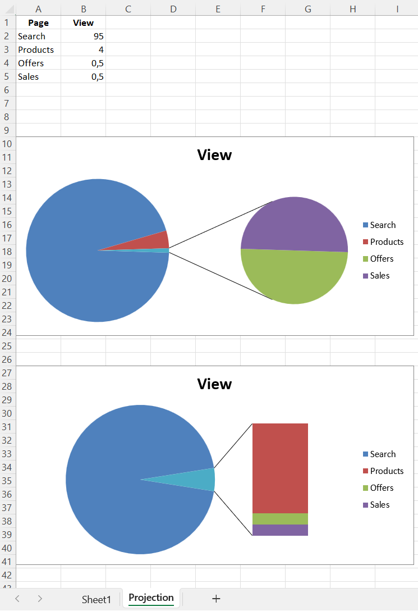
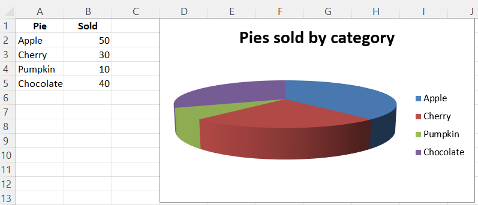
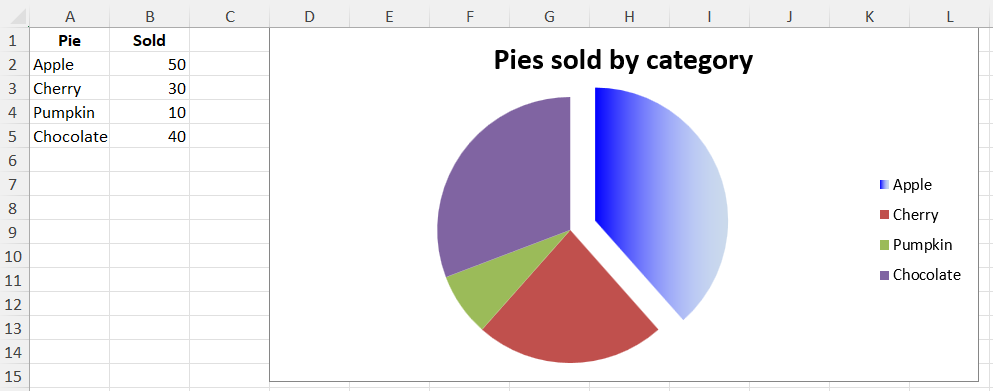

# Pie Charts

## Pie Chart 2D

Pie charts plot data as slices of a circle with each slice representing the percentage of the whole. Slices are plotted in a clockwise direction with 0° being at the top of the circle. Pie charts can only take a single series of data. The title of the chart will default to being the title of the series.

```r
library(xlcharts)

pie_data <- data.frame(
  "Pie" = c("Apple", "Cherry", "Pumpkin", "Chocolate"),
  "Sold" = c(50, 30, 10, 40)
)
pie_project_data <- data.frame(
  "Page" = c("Search", "Products", "Offers", "Sales"),
  "View" = c(95, 4, 0.5, 0.5)
)

write_xlsx(x = list(
  "Sheet1" = pie_data, 
  "Projection" = pie_project_data
  ), 
  path = "pie.xlsx")

wb <- load_workbook(filename = "pie.xlsx")
ws <- wb |> active()

pie <- PieChart(
  title = "Pies sold by category"
)
labels <- Reference(ws, min_col=1, min_row=2, max_row=5)
data <- Reference(ws, min_col=2, min_row=1, max_row=5)
pie |> add_data(data, titles_from_data = TRUE)
pie |> set_categories(labels)

# Cut the first slice out of the pie
slice <- DataPoint(idx = 0, explosion = 20L)

pie$series[[1]]$data_points <- list(slice)

ws |> add_chart(pie, "D1")

#ws <- wb$create_sheet(title="Projection")
ws <- wb[["Projection"]]

projected_pie <- ProjectedPieChart(
  type = "pie",
  splitType = "val" # split by value
)

labels <- Reference(ws, min_col=1, min_row=2, max_row=5)
data <- Reference(ws, min_col=2, min_row=1, max_row=5)

projected_pie |> add_data(data, titles_from_data = TRUE)
projected_pie |> set_categories(labels)

ws |> add_chart(projected_pie, "A10")

projected_bar <- deepcopy(projected_pie)
projected_bar$type <- "bar"
projected_bar$splitType <- "pos"

ws |> add_chart(projected_bar, "A27")

wb |> save_workbook("pie.xlsx")
```



## Projected Pie Charts

Projected pie charts extract some slices from a pie chart and project them into a second pie or bar chart. This is useful when there are several smaller items in the data series. The chart can be split according to percent, val(ue) or pos(ition). If nothing is set then the application decides which to use. In addition custom splits can be defined.



## 3D Pie Charts

Pie charts can also be created with a 3D effect.

<div class="admonition warning">
<p class="admonition-title">Warning</p>
<p>3D charts are almost always inappropriately used, as interpretation is improved by turning them into regular 2D figures. Please avoid making 3D charts.</p>
</div>

```r
library(xlcharts)

pie_data <- data.frame(
  "Pie" = c("Apple", "Cherry", "Pumpkin", "Chocolate"),
  "Sold" = c(50, 30, 10, 40)
)

write_xlsx(pie_data, path = "pie3D.xlsx")

wb <- load_workbook(filename = "pie3D.xlsx")
ws <- wb |> active()

pie3d = PieChart3D(
  title = "Pies sold by category"
)
labels <- Reference(ws, min_col=1, min_row=2, max_row=5)
data <- Reference(ws, min_col=2, min_row=1, max_row=5)
pie3d |> add_data(data, titles_from_data = TRUE)
pie3d |> set_categories(labels)

ws |> add_chart(pie3d, "D1")

wb |> save_workbook("pie3D.xlsx")
```



## Gradient Pie Charts

Pie charts can also be created with gradient series.

```{r}
library(xlcharts)

pie_data <- data.frame(
  "Pie" = c("Apple", "Cherry", "Pumpkin", "Chocolate"),
  "Sold" = c(50, 30, 10, 40)
)

write_xlsx(pie_data, path = "pie-gradient.xlsx")

wb <- load_workbook(filename = "pie-gradient.xlsx")
ws <- wb |> active()

pie_gradient <- PieChart(
  title = "Pies sold by category"
)
labels <- Reference(ws, min_col=1, min_row=2, max_row=5)
data <- Reference(ws, min_col=2, min_row=1, max_row=5)
pie_gradient |> add_data(data, titles_from_data = TRUE)
pie_gradient |> set_categories(labels)

# Cut the first slice out of the pie and apply a gradient to it
slice <- DataPoint(
    idx = 0,
    explosion = 20,
    spPr = GraphicalProperties(
        gradFill = GradientFillProperties(
            gsLst = list(
                GradientStop(
                    pos=0,
                    prstClr='blue'
                ),
                GradientStop(
                    pos=100000,
                    schemeClr=SchemeColor(
                        val='accent1',
                        lumMod=30000,
                        lumOff=70000
                    )
                )
            )
        )
    )
)

pie_gradient$series[[1]]$data_points <- list(slice)

ws |> add_chart(pie_gradient, "D1")

save_workbook(wb, "pie-gradient.xlsx")
```



<small>This page is an R replica of the related [OpenPyXL documentation page](https://openpyxl.readthedocs.io/en/stable/charts/pie.html).</small>
