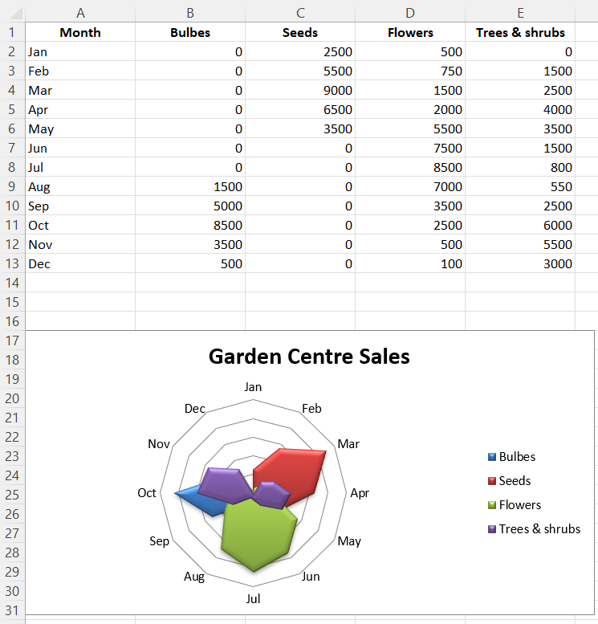

# Radar Charts

Data that is arranged in columns or rows on a worksheet can be plotted in a radar chart. Radar charts compare the aggregate values of multiple data series. It is effectively a projection of an area chart on a circular x-axis.

There are two types of radar chart: standard, where the area is marked with a line; and filled, where the whole area is filled. The additional type “marker” has no effect. If markers are desired these can be set for the relevant series.

```r
library(xlcharts)

radar <- data.frame(
  "Month" = c("Jan","Feb","Mar","Apr","May", "Jun","Jul","Aug","Sep","Oct","Nov","Dec"),
  "Bulbes" = c(0L, 0L, 0L, 0L, 0L, 0L, 0L, 1500L, 5000L, 8500L, 3500L, 500L),
  "Seeds" = c(2500L, 5500L, 9000L, 6500L, 3500L, 0L, 0L, 0L, 0L, 0L, 0L, 0L),
  "Flowers" = c(500L,750L,1500L,2000L,5500L,7500L, 8500L,7000L,3500L,2500L,500L,100L),
  "Trees & shrubs" = c(0L,1500L,2500L,4000L, 3500L,1500L,800L,550L,2500L,6000L,5500L,3000L),
  check.names = FALSE
)

write_xlsx(radar, "radar.xlsx")

wb <- load_workbook(filename = "radar.xlsx")
ws <- wb |> active()

chart <- RadarChart(
  title = "Garden Centre Sales",
  style = 26,
  type = "filled",
) |>
  y_axis(delete = TRUE)

labels <- Reference(ws, min_col=1, min_row=2, max_row=13)
data <- Reference(ws, min_col=2, max_col=5, min_row=1, max_row=13)
chart |> add_data(data, titles_from_data = TRUE)
chart |> set_categories(labels)

ws |> add_chart(chart, "A17")

wb |> save_workbook("radar.xlsx")
```



<small>This page is an R replica of the related [OpenPyXL documentation page](https://openpyxl.readthedocs.io/en/stable/charts/radar.html).</small>
