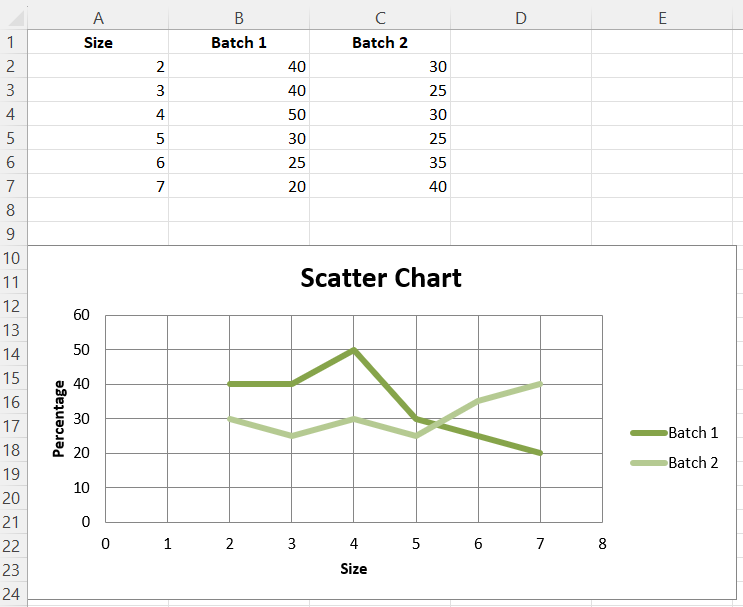

# Scatter Charts

Scatter, or xy, charts are similar to some line charts. The main difference is that one series of values is plotted against another. This is useful where values are unordered.

```r
library(xlcharts)

scatter <- data.frame(
  "Size" = c(2,3,4,5,6,7),
  "Batch 1" = c(40,40,50,30,25,20),
  "Batch 2" = c(30,25,30,25,35,40), 
  check.names = FALSE
)

write_xlsx(scatter, "scatter.xlsx")

wb <- load_workbook(filename = "scatter.xlsx")
ws <- wb |> active()

chart <- ScatterChart(
  title = "Scatter Chart",
  style = 13
) |>
  x_axis(title = 'Size') |> 
  y_axis(title = 'Percentage')

xvalues <- Reference(ws, min_col=1, min_row=2, max_row=7)

for (i in c(2:3)) {
  values <- Reference(ws, min_col=i, min_row=1, max_row=7)
  series <- Series(values, xvalues, title_from_data=TRUE)
  chart$append(series)
}

ws |> add_chart(chart, "A10")

wb |> save_workbook("scatter.xlsx")
```



<div class="admonition note">
<p class="admonition-title">Note</p>
<p>The specification says that there are the following types of scatter charts: ‘line’, ‘lineMarker’, ‘marker’, ‘smooth’, ‘smoothMarker’. However, at least in Microsoft Excel, this is just a shortcut for other settings that otherwise have no effect. For consistency with line charts, the style for each series should be set manually.</p>
</div>

<small>This page is an R replica of the related [OpenPyXL documentation page](https://openpyxl.readthedocs.io/en/stable/charts/scatter.html).</small>
