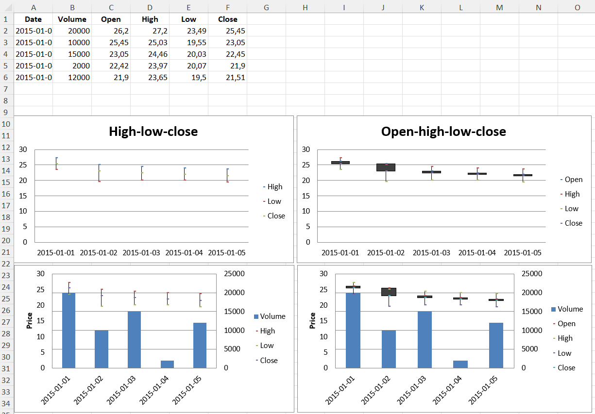

# Stock Charts

Data that is arranged in columns or rows in a specific order on a worksheet can be plotted in a stock chart. As its name implies, a stock chart is most often used to illustrate the fluctuation of stock prices. However, this chart may also be used for scientific data. For example, you could use a stock chart to indicate the fluctuation of daily or annual temperatures. You must organize your data in the correct order to create stock charts.

The way stock chart data is organized in the worksheet is very important. For example, to create a simple high-low-close stock chart, you should arrange your data with High, Low, and Close entered as column headings, in that order.

Although stock charts are a distinct type, the various types are just shortcuts for particular formatting options:

- high-low-close is essentially a line chart with no lines and the marker set to XYZ. It also sets hiLoLines to TRUE.
- open-high-low-close is the same as a high-low-close chart with the marker for each data point set to XZZ and upDownLines.

Volume can be added by combining the stock chart with a bar chart for the volume.

```{r}
library(xlcharts)

stock <- data.frame(
  "Date" = c("2015-01-01", "2015-01-02", "2015-01-03", "2015-01-04", "2015-01-05"),
  "Volume" = c(20000, 10000, 15000, 2000, 12000),
  "Open" = c(26.2, 25.45, 23.05, 22.42, 21.9),
  "High" = c(27.20, 25.03, 24.46, 23.97, 23.65),
  "Low" = c(23.49, 19.55, 20.03, 20.07, 19.50),
  "Close" = c(25.45, 23.05, 22.45, 21.90, 21.51)
)

write_xlsx(stock, path = "stock.xlsx")

wb <- load_workbook(filename = "stock.xlsx")
ws <- wb |> active()

# High-low-close
c1 <- StockChart(
  title = "High-low-close",
  hiLowLines = ChartLines()
)
labels <- Reference(ws, min_col=1, min_row=2, max_row=6)
data <- Reference(ws, min_col=4, max_col=6, min_row=1, max_row=6)
c1 |> 
  add_data(data, titles_from_data = TRUE) |>
  set_categories(labels)

s <- c1$series

for(i in seq_along(s)) {
  s[[i]]$graphicalProperties <- GraphicalProperties(
    line = LineProperties(
      noFill = TRUE
    )
  )
}

for(i in seq_along(s)) {
  s[[i]]$marker <- Marker(
    symbol = "dot",
    size = 5
  )
}

# Excel is broken and needs a cache of values in order to display hiLoLines :-/
# see: https://openpyxl.readthedocs.io/en/stable/charts/stock.html
for(i in 1:length(data)) {
  pts <- NumVal(idx=i)
  cache <- NumData(pt = list(pts))
  c1$series[[1]]$val$numRef$numCache <- cache
}

ws |> add_chart(c1, "A10")

# Open-high-low-close
c2 <- StockChart()
data <- Reference(ws, min_col=3, max_col=6, min_row=1, max_row=6)
c2 |>
  add_data(data, titles_from_data=TRUE) |>
  set_categories(labels)

s2 <- c2$series

for(i in seq_along(s2)) {
  s2[[i]]$graphicalProperties <- GraphicalProperties(
    line = LineProperties(
      noFill = TRUE
    )
  )
}

for(i in seq_along(s2)) {
  s2[[i]]$marker <- Marker(
    symbol = "dot",
    size = 5
  )
}

c2$hiLowLines <- ChartLines()
c2$upDownBars <- UpDownBars()
c2$title <- "Open-high-low-close"

# add dummy cache
c2$series[[1]]$val$numRef$numCache <- cache

ws$add_chart(c2, "G10")

# Create bar chart for volume

bar = BarChart()
data = Reference(ws, min_col=2, min_row=1, max_row=6)
bar |> 
  add_data(data, titles_from_data=TRUE) |> 
  set_categories(labels)


# Volume-high-low-close
b1 <- deepcopy(bar)
c3 <- deepcopy(c1)
c3 |> 
  y_axis(
    majorGridlines = NULL,
    title = "Price",
    axId = 20
  )

b1$z_axis <- c3$y_axis

b1|> y_axis(crosses = "max")

# combine using iadd from the operator Python module
iadd(b1, c3)

ws$add_chart(b1, "A27")

## Volume-open-high-low-close
b2 <- deepcopy(bar)
c4 <- deepcopy(c2)
c4 |> 
  y_axis(
    majorGridlines = NULL,
    title = "Price",
    axId = 20)
b2$z_axis <- c4$y_axis
b2 |> y_axis(crosses = "max")

# combine using iadd from the operator Python module
iadd(b2, c4)

ws$add_chart(b2, "G27")

save_workbook(wb, "stock.xlsx")
```

<div class="admonition warning">
<p class="admonition-title">Warning</p>
<p>Due to a bug in Excel high-low lines will only be shown if at least one of the data series has some dummy values. This can be done with the following hack.
</p>

```r
for(i in 1:length(data)) {
  pts <- NumVal(idx=i)
  cache <- NumData(pt = list(pts))
  c1$series[[1]]$val$numRef$numCache <- cache
}
```

</div>



<small>This page is an R replica of the related [OpenPyXL documentation page](https://openpyxl.readthedocs.io/en/stable/charts/stock.html).</small>
