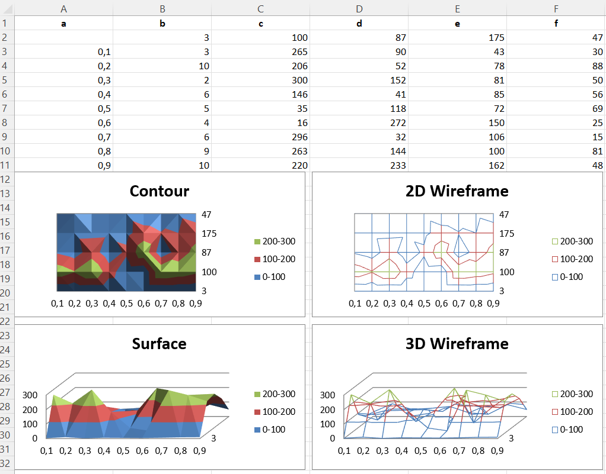

# Surface charts

Data that is arranged in columns or rows on a worksheet can be plotted in a
surface chart. A surface chart is useful when you want to find optimum
combinations between two sets of data. As in a topographic map, colors and
patterns indicate areas that are in the same range of values.

By default all surface charts are 3D. 2D wireframe and contour charts are
created by setting the rotation and perspective.

```r
library(xlcharts)

set.seed(123)

surface <- data.frame(
  a = c(NA,0.1,0.2,0.3,0.4,0.5,0.6,0.7,0.8,0.9),
  b = sample(10,100, size = 10),
  c = sample(10:300, size = 10),
  d = sample(10:300, size = 10),
  e = sample(10:200, size = 10),
  f = sample(10:100, size = 10)
)

write_xlsx(surface, path = "surface.xlsx")

wb <- load_workbook(filename = "surface.xlsx")
ws <- wb |> active()

c1 <- SurfaceChart(
  title = "Contour"
)
ref <- Reference(ws, min_col=2, max_col=6, min_row=2, max_row=11)
labels <- Reference(ws, min_col=1, min_row=3, max_row=11)

c1 |> 
  add_data(ref, titles_from_data = TRUE) |> 
  set_categories(labels)

ws |> add_chart(c1, "A12")

# wireframe
c2 <- SurfaceChart(
  wireframe = TRUE,
  title = "2D Wireframe"
)

c2 |> 
  add_data(ref, titles_from_data = TRUE) |> 
  set_categories(labels)

ws |> add_chart(c2, "G12")

# 3D Surface
c3 <- SurfaceChart3D(
  title = "Surface"
)

c3 |> 
  add_data(ref, titles_from_data = TRUE) |> 
  set_categories(labels)

ws |> add_chart(c3, "A29")

c4 <- SurfaceChart3D(
  wireframe = TRUE,
  title = "3D Wireframe"
)

c4 |> 
  add_data(ref, titles_from_data = TRUE) |> 
  set_categories(labels)

ws |> add_chart(c4, "G29")

wb |> save_workbook("surface.xlsx")
```



<small>This page is an R replica of the related [OpenPyXL documentation page](https://openpyxl.readthedocs.io/en/stable/charts/surface.html).</small>
