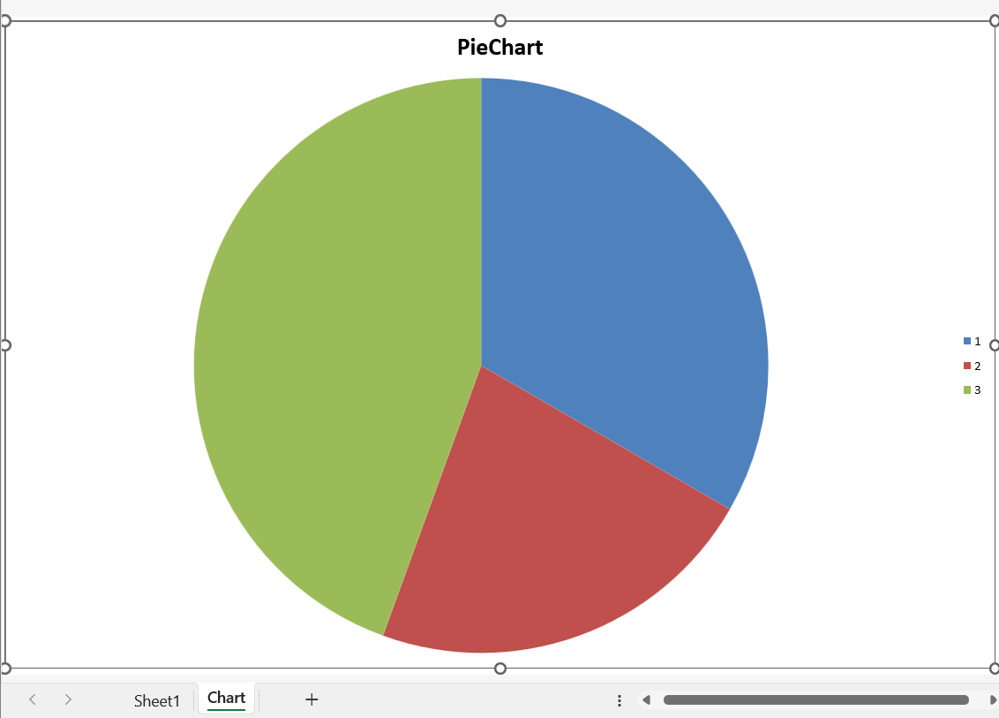

# Chartsheets

Chartsheets are special worksheets which only contain charts. All the data for the chart must be on a different worksheet.

```r
library(xlcharts)

chartsheet <- data.frame(
  "Person" = c("Bob", "Harry", "James"),
  "Number" = c(3, 2, 4)
)

write_xlsx(chartsheet, "chartsheet.xlsx")

wb <- load_workbook(filename = "chartsheet.xlsx") 
cs <- wb$create_chartsheet()

chart = PieChart(
  title = "PieChart"
)

labels <- Reference(ws, min_col=1, min_row=2, max_row=4)
data <- Reference(ws, min_col=2, min_row=2, max_row=4)

chart$series <- list(Series(data))

cs |> add_chart(chart)

wb |> save_workbook("chartsheet.xlsx")
```



By default in Microsoft Excel, charts are chartsheets are designed to fit the page format of the active printer. By default in openpyxl, charts are designed to fit window in which they’re displayed. You can flip between these using the zoomToFit attribute of the active view.

<small>This page is an R replica of the related [OpenPyXL documentation page](https://openpyxl.readthedocs.io/en/stable/charts/chartsheet.html).</small>
