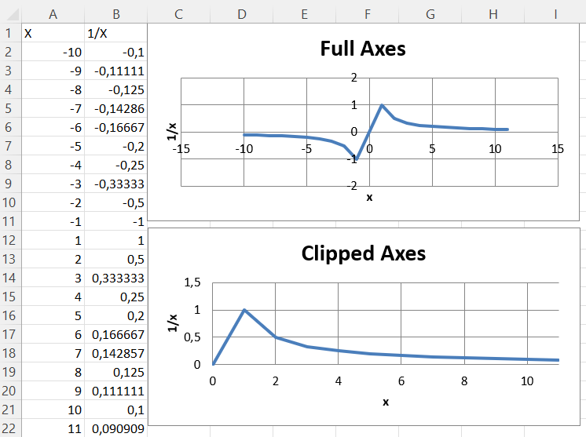
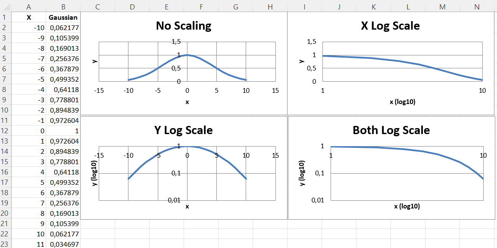
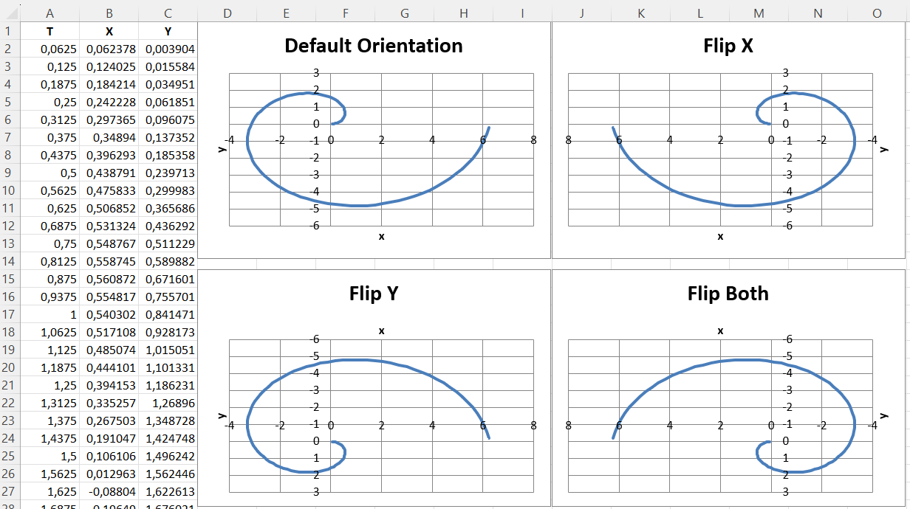

# Axis Limits and Scale

## Minima and Maxima

Axis minimum and maximum values can be set manually to display specific regions on a chart.

```r
library(xlcharts)

wb <- Workbook()
ws <- wb |> active()

# add headers
ws$append(c('X', '1/X'))

for(x in c(-10:11)) {
  if(x) {
    ws$append(c(x, 1.0 / x))
  }
}

chart1 <- ScatterChart(
  title = "Full Axes",
  legend = NULL
) |>
  x_axis(title = 'x') |>
  y_axis(title = '1/x')

chart2 <- ScatterChart(
  title = "Clipped Axes",
  legend = NULL
) |> 
  x_axis(
    title = 'x',
    scaling = Scaling(
      min = 0,
      max = 11
      )
    ) |> 
  y_axis(
    title = '1/x',
    scaling = Scaling(
      min = 0,
      max = 1.5
      )
    )

x <- Reference(ws, min_col=1, min_row=2, max_row=22)
y <- Reference(ws, min_col=2, min_row=2, max_row=22)
s <- Series(y, xvalues=x)

chart1$append(s)
chart2$append(s)

ws |> add_chart(chart1, "C1")
ws |> add_chart(chart2, "C15")

wb |> save_workbook("minmax.xlsx")

```



!! Note
  In some cases such as the one shown, setting the axis limits is effectively equivalent to displaying a sub-range of the data. For large datasets, rendering of scatter plots (and possibly others) will be much faster when using subsets of the data rather than axis limits in both Excel and Open/Libre Office.

## Logarithmic Scaling

Both the x- and y-axes can be scaled logarithmically. The base of the logarithm can be set to any valid float. If the x-axis is scaled logarithmically, negative values in the domain will be discarded.

```r
library(xlcharts)

log <- data.frame(
  "X" = c(-10:11),
  "Gaussian" = writexl::xl_formula(paste0("=EXP(-(($A$", c(seq_along(-10:11) + 1),"/6)^2))"))
)

write_xlsx(log, "log.xlsx")

wb <- load_workbook(filename = "log.xlsx") 
ws <- wb |> active()

chart1 <- ScatterChart(
  title = "No Scaling",
  legend = NULL
) |> 
  x_axis(title = 'x') |>
  y_axis(title = 'y')

chart2 <- ScatterChart(
  title = "X Log Scale",
  legend = NULL
) |>
  x_axis(
    title = 'x (log10)',
    scaling = Scaling(logBase = 10)
  ) |>
  y_axis(title = 'y')

chart3 <- ScatterChart(
  title = "Y Log Scale",
  legend = NULL
) |>
  x_axis(title = 'x') |>
  y_axis(
    title = 'y (log10)',
    scaling = Scaling(logBase = 10)
  )

chart4 <- ScatterChart(
  title = "Both Log Scale",
  legend = NULL
) |>
  x_axis(
    title = 'x (log10)',
    scaling = Scaling(logBase = 10)
  ) |>
  y_axis(
    title = 'y (log10)',
    scaling = Scaling(logBase = 10)
  )


x <- Reference(ws, min_col=1, min_row=2, max_row=22)
y <- Reference(ws, min_col=2, min_row=2, max_row=22)
s <- Series(y, xvalues=x)
chart1$append(s)
chart2$append(s)
chart3$append(s)
chart4$append(s)

ws |> add_chart(chart1, "C1")
ws |> add_chart(chart2, "I1")
ws |> add_chart(chart3, "C15")
ws |> add_chart(chart4, "I15")

wb |> save_workbook("log.xlsx")
```

This produces four charts that look something like this:



The four charts show the same data unscaled, scaled logarithmically in each axis and in both axes, with the logarithm base set to 10.

## Axis Orientation

Axes can be displayed “normally” or in reverse. Axis orientation is controlled by the scaling orientation property, which can have a value of either 'minMax' for normal orientation or 'maxMin' for reversed.

```r
library(xlcharts)

orientation <- data.frame(
  "T" = c(1:100/16.0),
  "X" = writexl::xl_formula(paste0("=$A$", c(seq_along(c(1:100/16.0)) + 1), "*COS($A$", c(seq_along(c(1:100/16.0)) + 1), ")")),
  "Y" = writexl::xl_formula(paste0("=$A$", c(seq_along(c(1:100/16.0)) + 1), "*SIN($A$", c(seq_along(c(1:100/16.0)) + 1), ")"))
)

write_xlsx(orientation, "orientation.xlsx")

wb <- load_workbook(filename = "orientation.xlsx") 
ws <- wb |> active()

chart1 <- ScatterChart(
  title = "Default Orientation",
  legend = NULL
) |> 
  x_axis(title = 'x') |>
  y_axis(title = 'y')

chart2 <- ScatterChart(
  title = "Flip X",
  legend = NULL
) |> 
    x_axis(
    title = 'x',
    scaling = Scaling(orientation = "maxMin")
  ) |>
  y_axis(
    title = 'y',
    scaling = Scaling(orientation = "minMax")
  )

chart3 <- ScatterChart(
  title = "Flip Y",
  legend = NULL
) |> 
    x_axis(
    title = 'x',
    scaling = Scaling(orientation = "minMax")
  ) |>
  y_axis(
    title = 'y',
    scaling = Scaling(orientation = "maxMin")
  )

chart4 <- ScatterChart(
  title = "Flip Both",
  legend = NULL
) |> 
    x_axis(
    title = 'x',
    scaling = Scaling(orientation = "maxMin")
  ) |>
  y_axis(
    title = 'y',
    scaling = Scaling(orientation = "maxMin")
  )

x <- Reference(ws, min_col=2, min_row=2, max_row=102)
y <- Reference(ws, min_col=3, min_row=2, max_row=102)
s <- Series(y, xvalues=x)
chart1$append(s)
chart2$append(s)
chart3$append(s)
chart4$append(s)

ws |> add_chart(chart1, "D1")
ws |> add_chart(chart2, "J1")
ws |> add_chart(chart3, "D15")
ws |> add_chart(chart4, "J15")

wb |> save_workbook("orientation.xlsx")
```

This produces four charts with the axes in each possible combination of orientations that look something like this:



<small>This page is an R replica of the related [OpenPyXL documentation page](https://openpyxl.readthedocs.io/en/stable/charts/limits_and_scaling.html).</small>
