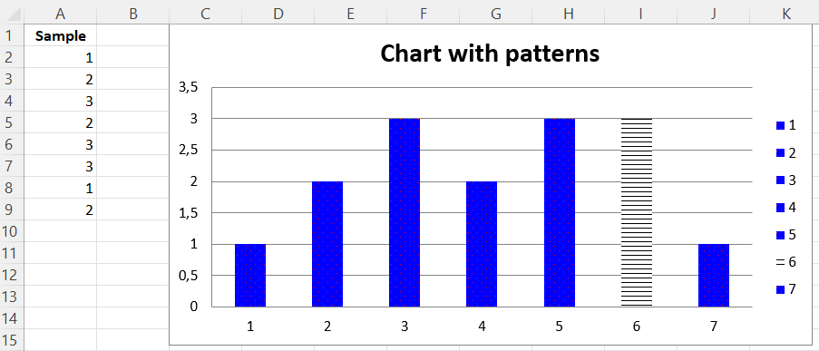

# Adding Patterns

Whole data series and individual data points can be extensively styled through the graphicalProperties. Getting things just right may take some time.

```r
library(xlcharts)

pattern <- data.frame(
  "Sample" = c(1,2,3,2,3,3,1,2)
)

write_xlsx(pattern, "pattern.xlsx")

wb <- load_workbook(filename = "pattern.xlsx") 
ws <- wb |> active()

c <- BarChart(
  title = "Chart with patterns"
)
data <- Reference(ws, min_col=1, min_row=1, max_row=8)

c |> add_data(data, titles_from_data=TRUE)

# set a pattern for the whole series
series = c$series[[1]]

fill <- PatternFillProperties(
  prst = "pct5",
  foreground = ColorChoice(prstClr="red"),
  background = ColorChoice(prstClr="blue")
  )

series$graphicalProperties <- GraphicalProperties(
  pattFill = fill
)

# set a pattern for a 6th data point 
# (Python is 0-indexed)
pt <- DataPoint(idx = 5)

pt$graphicalProperties$pattFill <- PatternFillProperties(prst="ltHorz")

series$data_points <- list(pt)

ws |> add_chart(c, "C1")

wb |> save_workbook("pattern.xlsx")
```



<small>This page is an R replica of the related [OpenPyXL documentation page](https://openpyxl.readthedocs.io/en/stable/charts/pattern.html).</small>
