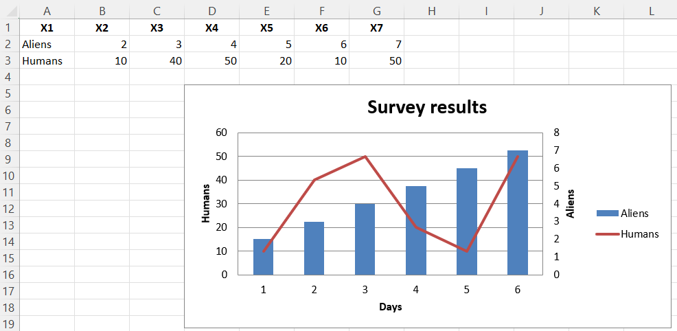

# Adding a second axis

Adding a second axis actually involves creating a second chart that shares a common x-axis with the first chart but has a separate y-axis.

```r
library(xlcharts)

secondary <- data.frame(
  "1" = c("Aliens", "Humans"),
  "2" = c(2, 10),
  "3" = c(3, 40),
  "4" = c(4, 50),
  "5" = c(5, 20),
  "6" = c(6, 10),
  "7" = c(7, 50)
)

write_xlsx(secondary, "secondary.xlsx")

wb <- load_workbook(filename = "secondary.xlsx") 
ws <- wb |> active()

c1 <- BarChart(
  title = 'Survey results'
) |>
  x_axis(title = "Days") |>
  y_axis(title = "Aliens",
         majorGridlines = NULL)

v1 <- Reference(ws, min_col=1, min_row=2, max_col=7)
c1 |> add_data(v1, titles_from_data=TRUE, from_rows=TRUE)


# Create a second chart
c2 <- LineChart() |>
  y_axis(title = "Humans", axId = 200)
v2 <- Reference(ws, min_col=1, min_row=3, max_col=7)
c2 |> add_data(v2, titles_from_data=TRUE, from_rows=TRUE)

# Display y-axis of the second chart on the right by setting it to cross the x-axis at its maximum
c1 |> 
  y_axis(crosses = "max")

# combine using iadd from the operator Python module
iadd(c1, c2)

ws |> add_chart(c1, "D5")

wb |> save_workbook("secondary.xlsx")
```

This produces a combined line and bar chart looking something like this:



<small>This page is an R replica of the related [OpenPyXL documentation page](https://openpyxl.readthedocs.io/en/stable/charts/secondary.html).</small>
